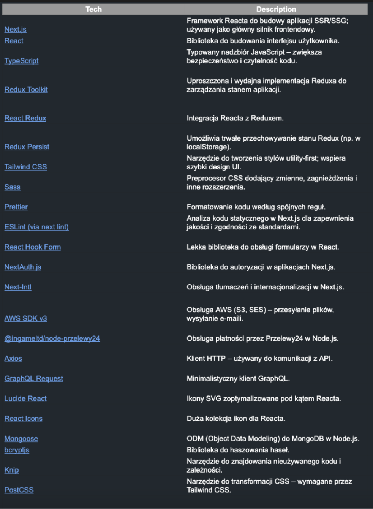

# Zeliwne


## Ekrany aplikacji/ Screens for Appliacation


## Opis projektu / Project Description

### [POL]

Fizjoteka to pełnoprawna aplikacja zakupowa stworzona z myślą o elastyczności i łatwej obsłudze przez administratora. 
Pozwala użytkownikom przeglądać i kupować produkty cyfrowe, a administratorom zarządzać całą zawartością poprzez dedykowany panel.
Projekt został stworzony jako praktyczne wdrożenie nowoczesnego e-commerce'u z wykorzystaniem narzędzi takich jak Next.js, MongoDB, Amazon S3/SES, oraz integracją z płatnościami i newsletterem.
### [ENG]

Fizjoteka is a fully-featured shopping application designed with flexibility and ease of use for administrators in mind.
It allows users to browse and purchase digital products, while administrators can manage all content through a dedicated panel.
The project was created as a practical implementation of modern e-commerce using tools such as Next.js, MongoDB, Amazon S3/SES, along with integration of payment systems and a newsletter.


## Architektura projektu


## TechStack



## Wymagania wstępne / Prerequisites

- **Node.js**: 18.17.0 (Zalecana: 22)
- **Git**: Wersja >2
- **Edytor kodu**: np. Visual Studio Code

- **Node.js**: 18.17.0 (Recommended: 22)
- **Git**: Version >2
- **Code editor**: e.g. Visual Studio Code


### Instalacja / Installation

1. Sklonuj repozytorium:
   ```bash
   git clone https://github.com/takimi12/Final-Zelwine
   ```
2. Zainstaluj zależności:
   ```bash
   npm install
   ```
3. Uruchom aplikację w trybie deweloperskim:

   ```bash
   npm run dev
   ```

4. Clone the repository:

```bash
git clone https://github.com/takimi12/Final-Fizjoteka2.git
```

2. Install dependencies:

```bash
npm install
```

3. Run the app in development mode:

```bash
npm run dev
```
## Link do aplikacji / Link for live app

https://fizjoteka2.vercel.app/

## Dostępy

## Co zostało zrobione

W aplikacji zostały wprowadzone następujące funkcjonalności:


###  Internacjonalizacja 
Wsparcie dla języka polskiego i angielskiego

### Baza danych  
Przechowywanie produktów w bazie danych **MongoDB**.

###  Przechowywanie plików  
Wykorzystanie **Amazon S3** do przechowywania plików powiązanych z produktami.

### ✉️Wysyłka wiadomości e-mail  
Integracja z **Amazon SES** jako providerem do wysyłki wiadomości e-mail.

###  Panel administratora  
Możliwość zarządzania zawartością aplikacji, w tym:

####  Produkty  
- Dodawanie, usuwanie, edycja produktów  
- Pola: `nazwa`, `cena`, `opis`, `kategoria`, `zdjęcie promocyjne`, `plik produktu`

####  Kategorie  
- Dodawanie, usuwanie, edycja kategorii  
- Pole: `nazwa`

####  Newsletter  
- Podgląd kontaktów zapisanych do newslettera

#### ✍️ Blog (Hygraph)  
- Połączenie z **Hygraph** w celu dodawania i edycji postów

####  Kody rabatowe  
- Możliwość dodawania kodów rabatowych w panelu administratora  
- Obsługa kodów rabatowych w koszyku

###  Płatności  
- Obsługa płatności za pomocą providera  **Przelewy24**  
- Po zakończonej płatności:  
  - Automatyczna wysyłka pliku produktu na adres e-mail użytkownika

## Plany na przyszłość.
Jest deweloperska aplikacji, która została oddana klientowi i zrealizowała wszystkie jego wymagania. W przyszłości, w celach naukowych planowane jest połączenie tej aplikacji
z wszysktimi polskimi providerami płatności, w celu oceny który z nich zapewnia najszybszą integrację z API.

## Kontakt do autora / Author Contact

- GitHub: [takimi12](https://github.com/takimi12)
- LinkedIn: [Tomasz Olech](https://www.linkedin.com/in/tomasz-olech-136b9a13a/)
- E-mail: [tomek12olech@gmail.com](mailto:tomek12olech@gmail.com)
